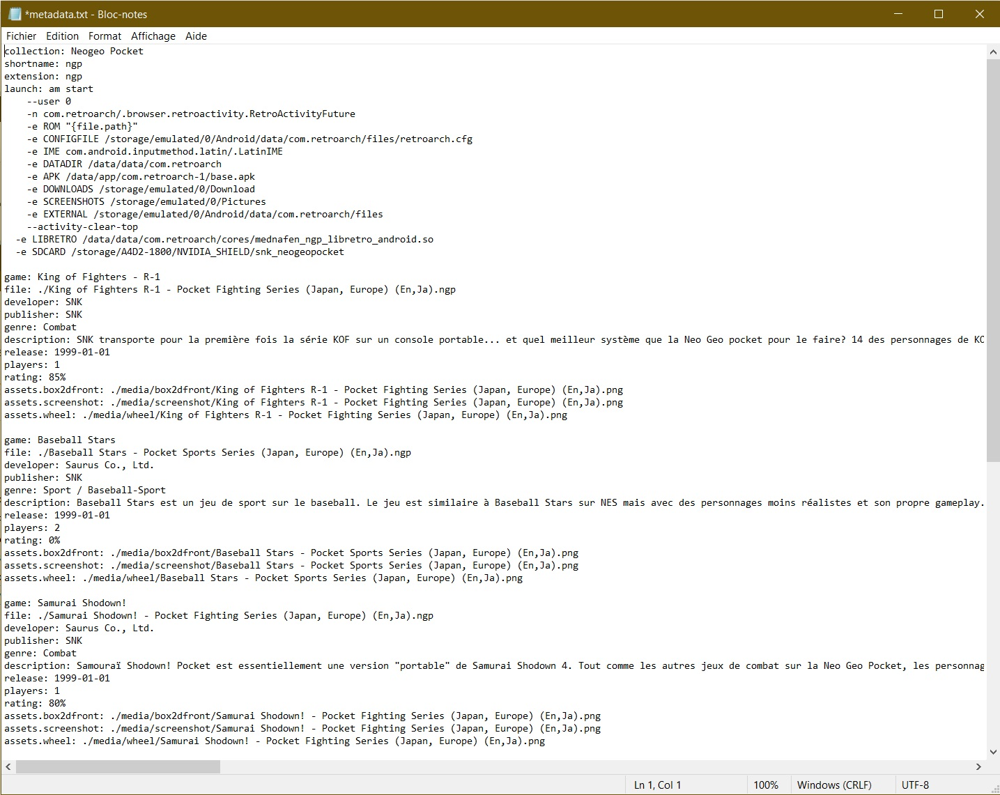

# bellerophon
          - a Pegasus-frontend companion

## Pegasus-frontend
[ https://pegasus-frontend.org ] or [ https://github.com/mmatyas/pegasus-frontend ]

Pegasus is a front-end to navigate in your games library. It relies on metadata.txt files that contain all data about games, paths and assets.

## What does Bellerophon ?
Bellerophon is a Python script to :
- automatically generate metadata.txt files
- move to a backup folder all leftover assets




## Requirements
Python >= 3.6

toml >= 0.10.1

You can type : `pip install requirements.txt`

In order to work the script also needs :

- one `gamelist.xml` file in each system folder
- assets folder named `media` in each system foler

If `gamelist.xml` is not found, the `metadata.txt` won't be created.

**So scrape your games and ask your software to output a gamelist.xml.**

**Skraper (Screen-scraper) does that very well. :)**

[ https://www.skraper.net ]

## Please, backup your `metadata.txt` files before running the script.
## The script overwrite all `metadata.txt` for systems listed in `bellerophon.conf` and move unused assets in `media.backup` folder if necessary.
## Nothing is removed.

## Usage
1. Download `bellerophon.py` and `bellerophon.sample.conf` at the root of your library. Below the tree of my own library :

```   
NVIDIA_SHIELD/
├─ bellerophon.py
├─ bellerophon.conf
└─ arcade/
    ├─ game1.zip
    ├─ game2.zip
    ├─ game3.zip
    ├─ gamelist.xml
    └─ media/
        ├─ wheel/
        |   ├─ game1.png
        |   ├─ game2.png
        |   └─ game3.png
        └─ screenshot/
            ├─ game1.png
            ├─ game2.png
            └─ game3.png
```

2. Rename `bellerophon.sample.conf` to `bellerophon.conf`
3. Edit `bellerophon.conf` according to your needs. Below the excerpt of the sample file :
```
[global]
    # Launch command (Retroarch) by default for all systems
    launch = """am start
    --user 0
    -n com.retroarch/.browser.retroactivity.RetroActivityFuture
    -e ROM \"{file.path}\"
    -e CONFIGFILE /storage/emulated/0/Android/data/com.retroarch/files/retroarch.cfg
    -e IME com.android.inputmethod.latin/.LatinIME
    -e DATADIR /data/data/com.retroarch
    -e APK /data/app/com.retroarch-1/base.apk
    -e DOWNLOADS /storage/emulated/0/Download
    -e SCREENSHOTS /storage/emulated/0/Pictures
    -e EXTERNAL /storage/emulated/0/Android/data/com.retroarch/files
    --activity-clear-top"""
    # Base path of your games (needed for Retroarch launch command)
    path = "/storage/A4D2-1800/NVIDIA_SHIELD/"

[systems]

    # Example
    [systems.arcade]
    shortname = "arcade"
    collection = "Arcade"
    extension = "chd,zip"
    core = "fbneo_libretro_android.so"

    # Example 2 : collection using stand-alone application
    [systems.sega_dreamcast]
    shortname = "dreamcast"
    collection = "Dreamcast"
    extension = "chd,iso"
    launch = "am start\n  --user 0\n  -a android.intent.action.VIEW\n  -n io.recompiled.redream/.MainActivity\n  -d 'file://{file.path}'"
```
    
4. On Desktop double-clic `bellerophon.py`.
On CLI type `py bellerophon.py`.

## Disclaimer
The script has been made for my use case but i tried to develop it with other needs in mind.
I personnaly don't use custom collections (e.g. "Platform games", "Best games for kids", etc.) so it may not work in thoses cases.
